##### These procedure steps will be followed on the simulator

1. Once the experiment is opened, click on the Description to understand the terminologies related to the experiment. Click on Next to proceed. 
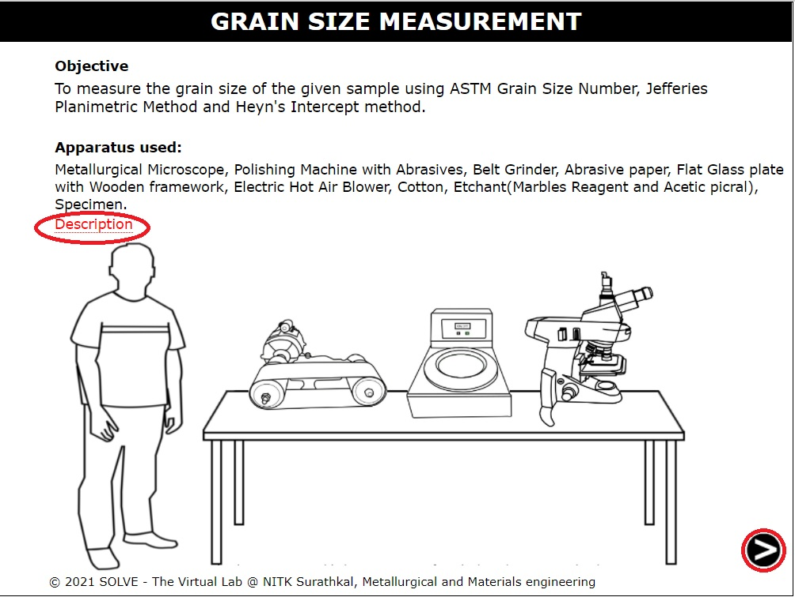 

2. Once the samples are obtained, click Next to proceed. 
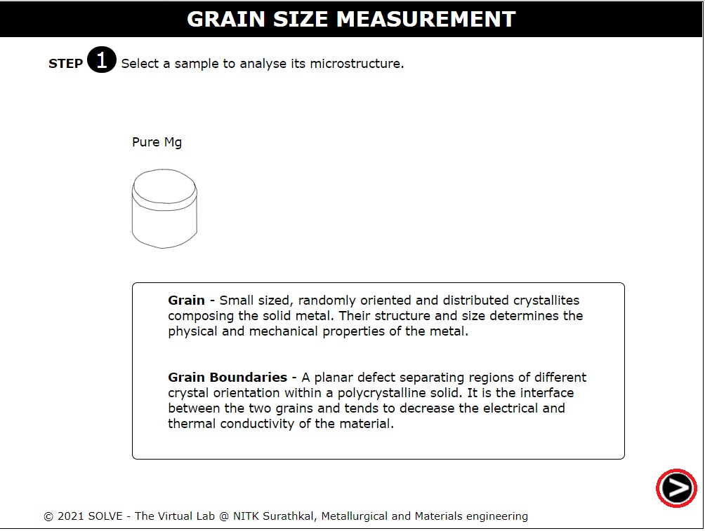 

3. Click on the switch first to switch on the furnace. Click on the + button to increase the temperature. Follow this by clicking on the door. 
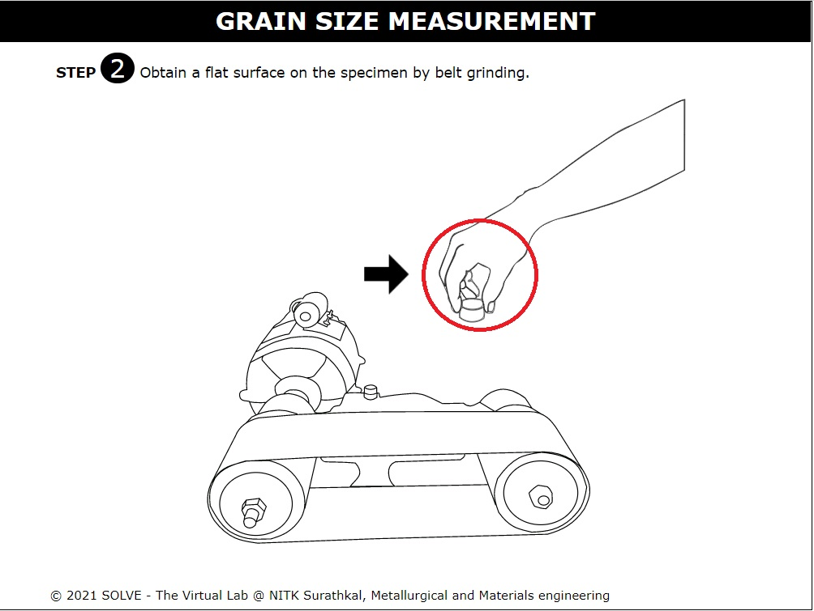 

4. Click on all 5 samples to load them into the furnace and click on the door to close the furnace door. 
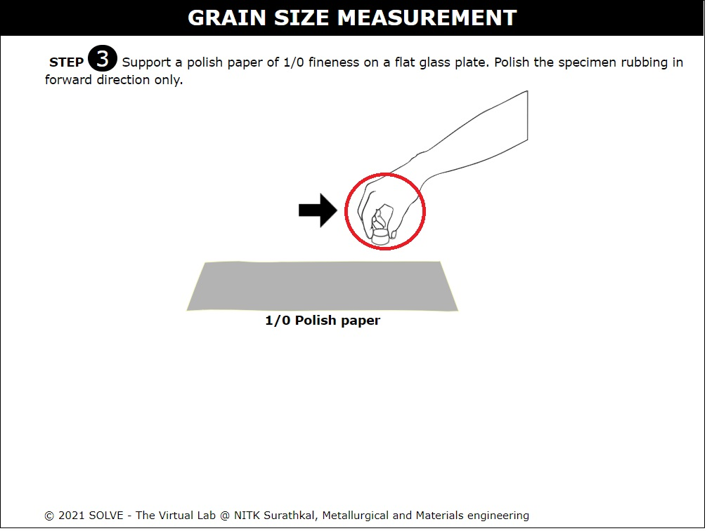 

5. Click on the switch OFF and click Next to proceed. 
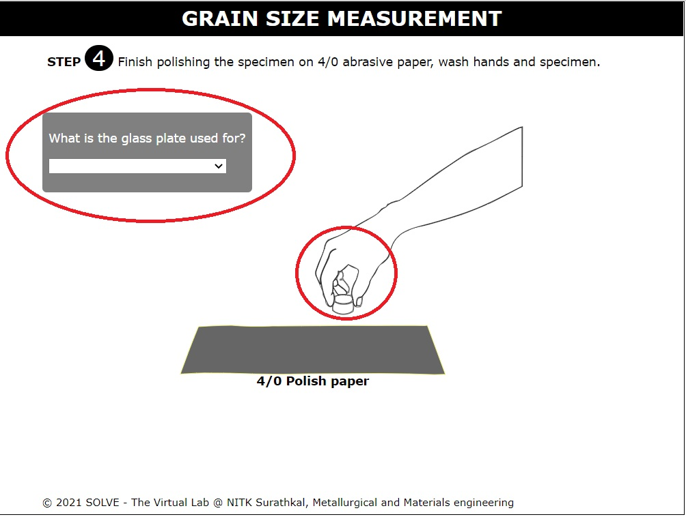 

6. Click on the furnace door to open it. Follow this by clicking on the four samples to quench them in the respective quenchant. Click on the furnace door again to close it.  
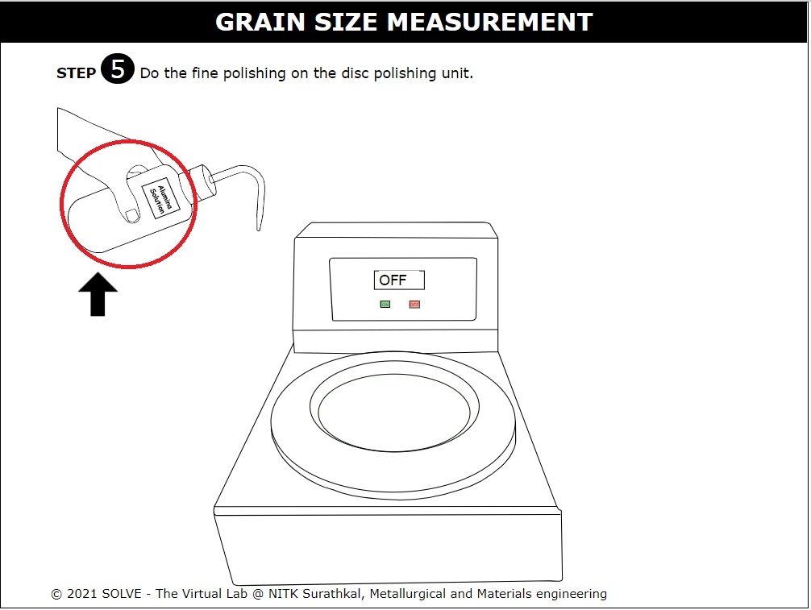 

7. Click on the furnace door to open it. Click on the sample to remove the normalized sample. Read the Note and click Ok.  
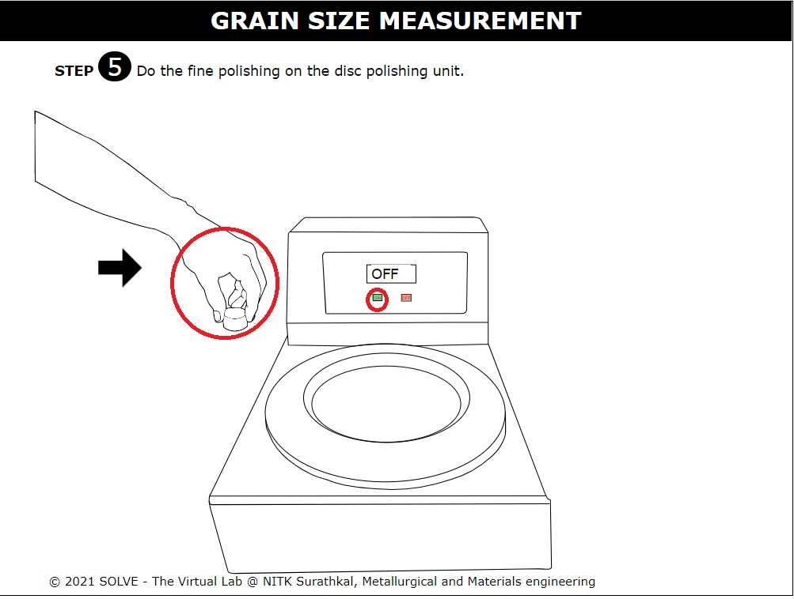 

8. Answer the question and click on next to proceed. 
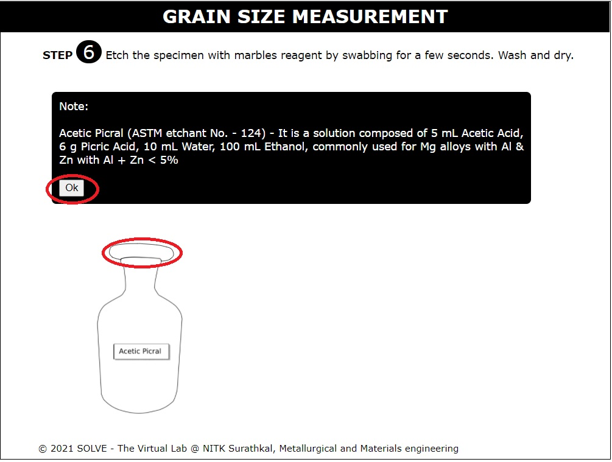 

9. Click on the hand to start the belt grinding process. Click on the Next button which appears after the step to proceed. 
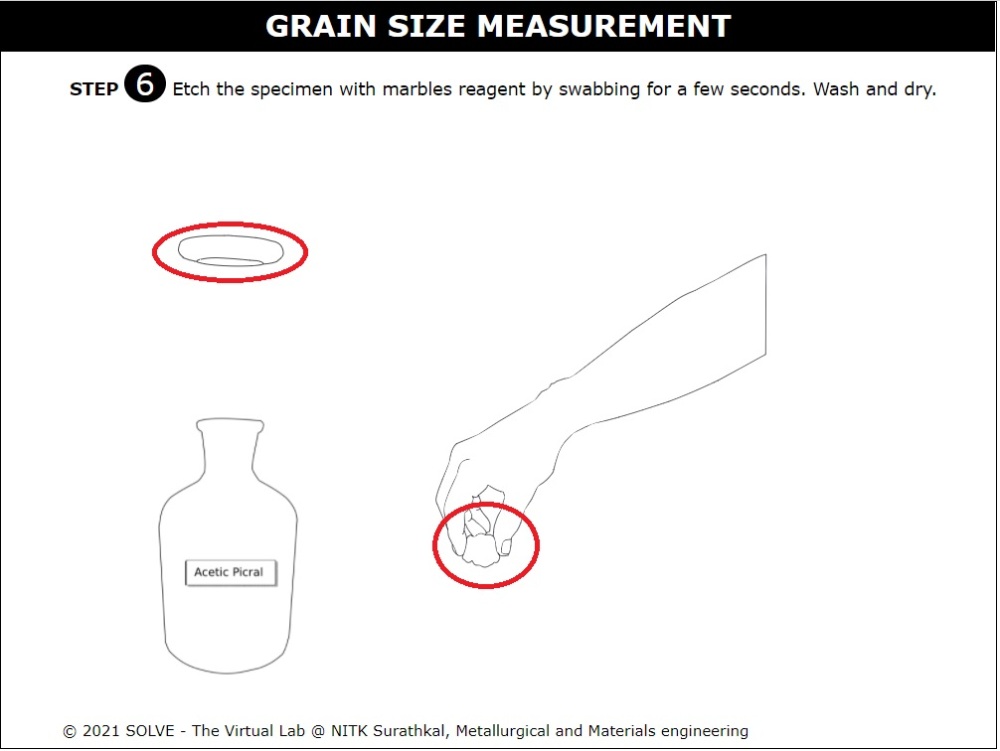 

10. Click on the hand to start polishing the sample and click Ok after reading the NOTE. Click on the Next button which appears after the step to proceed. 
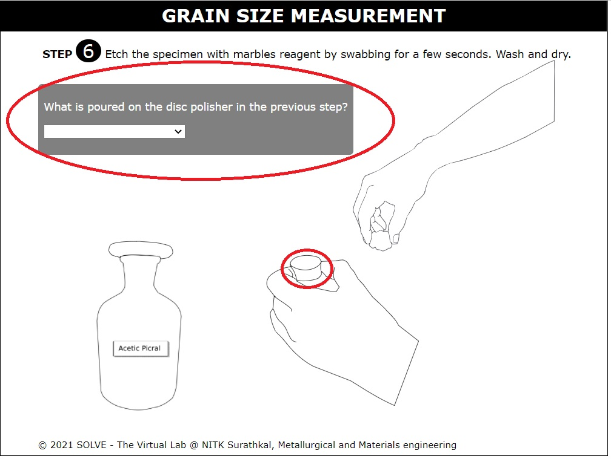 

11. Click on the hand first to continue the polishing of the sample. After this, answer the question. Click on the Next button which appears after the step to proceed. 
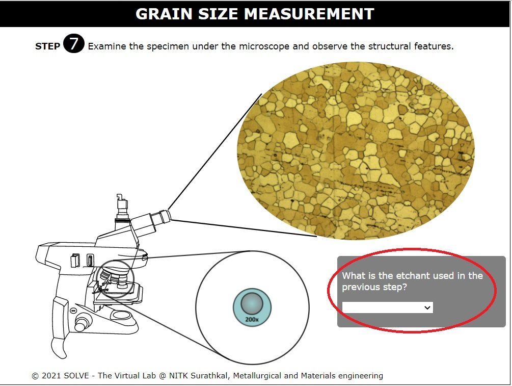 

12. Click on the bottle to pour the Alumina solution.  
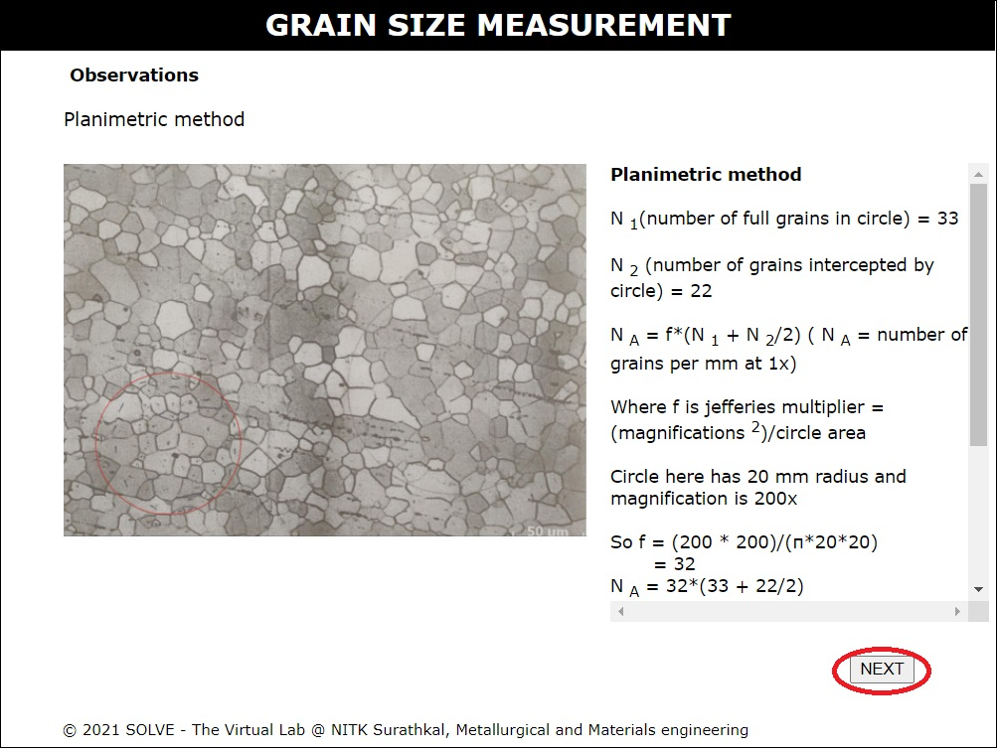 

13. Click on the hand first and then the switch-on button to start disc polishing. Switch-off to stop the disc polisher. Click Ok after reading the note.  Click on the Next button which appears after the step to proceed.  
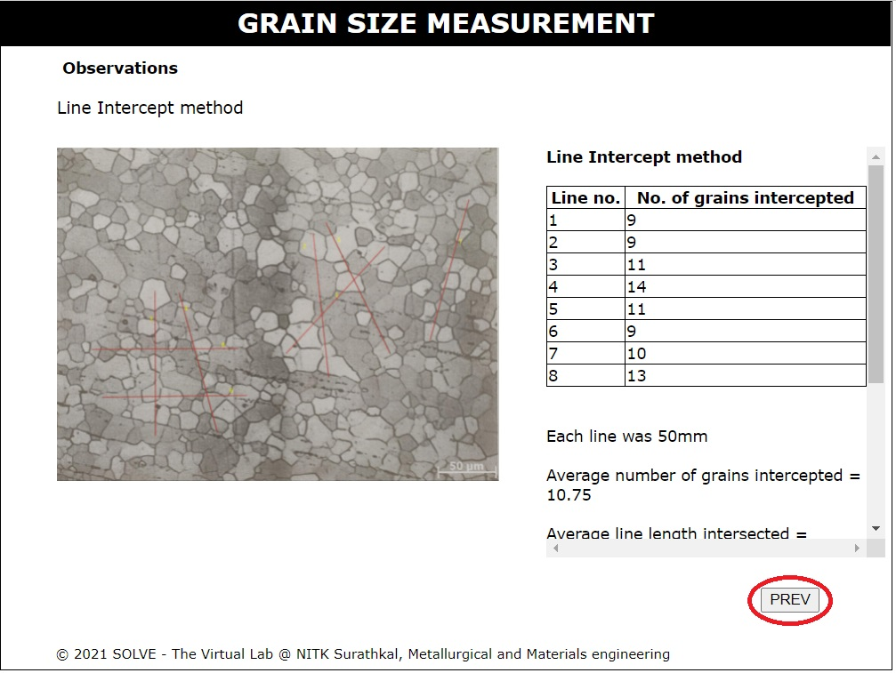 

14. Click Ok after reading the note. Click on the lid of the bottle.  
 

15. Click on the hand to soak the cotton with the reagent. Follow this by clicking on the lid to close the lid.  
 

16. Click on the sample to etch it. Follow this by answering the question.  Click on the Next button which appears after the step to proceed.  
 

17. Click on the arrow to change the magnification. Click on any sample in the list to view its microstructure. Follow this by answering the question. Click on the Next button which appears after the step to proceed. 
 

18. Read the information provided and click on Next to proceed. 
 

19. Click on the sample to load it on the Rockwell Hardness C machine. Move the mouse over the arrow shown to make contact with the indentor. Click on the Next button which appears after the step to proceed.  
 

20. Click on the scale to adjust the major load. Click on the lever to start hardness testing. Click the lever again after 15 seconds. Click on the Next button which appears after the step to proceed.  
 

21. Note the hardness values of all the samples and click on Next to proceed.  
 

22. Change the slider to view at different magnification. Click on any sample to view its microstructure. 
 
