##### These procedure steps will be followed on the simulator

1. Once the experiment is opened, click on the Description to understand the terminologies related to the experiment. Click on Next to proceed. 
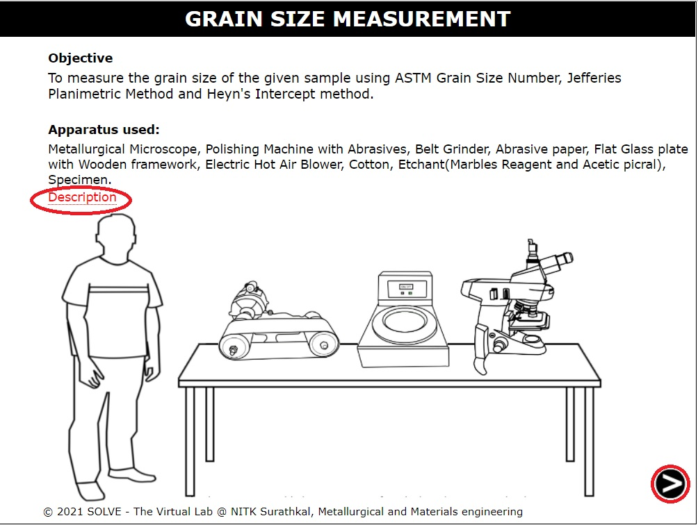 

2. View the sample and read the information on terms given which are important for the given experiment. Click on next to proceed. 
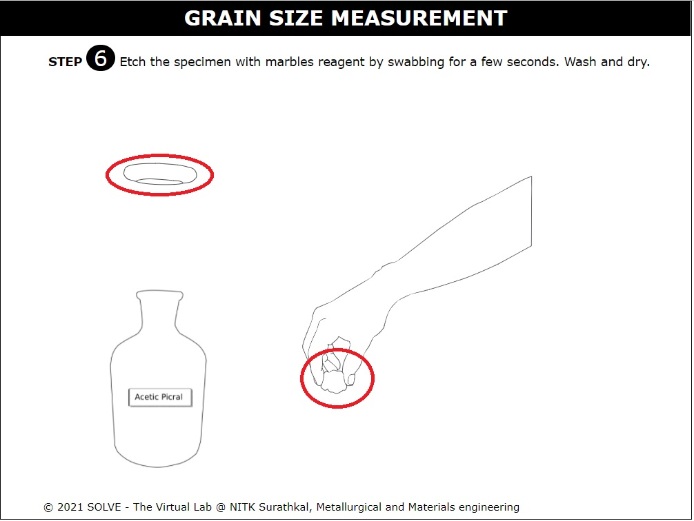 

3. Click on the hand to start the belt grinding process. Click on the Next button which appears after the step to proceed. 
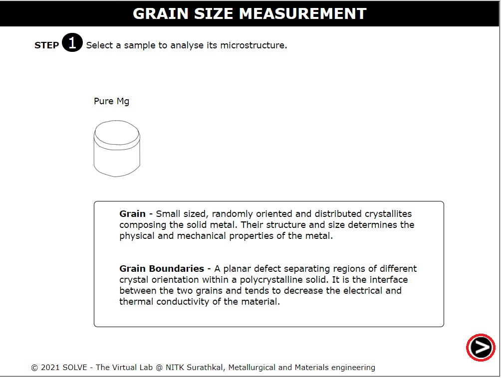 

4. Click on the hand to start polishing the sample and click Ok after reading the NOTE. Click on the Next button which appears after the step to proceed 
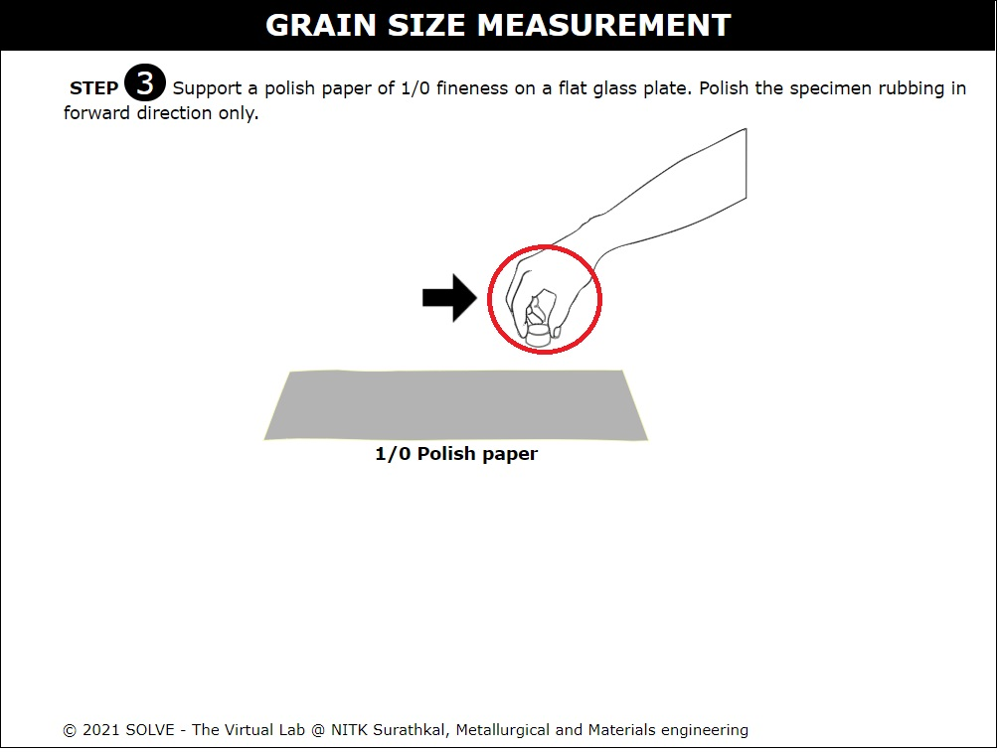 

5. Click on the hand first to continue the polishing of the sample. After this, answer the question. Click on the Next button which appears after the step to proceed. 
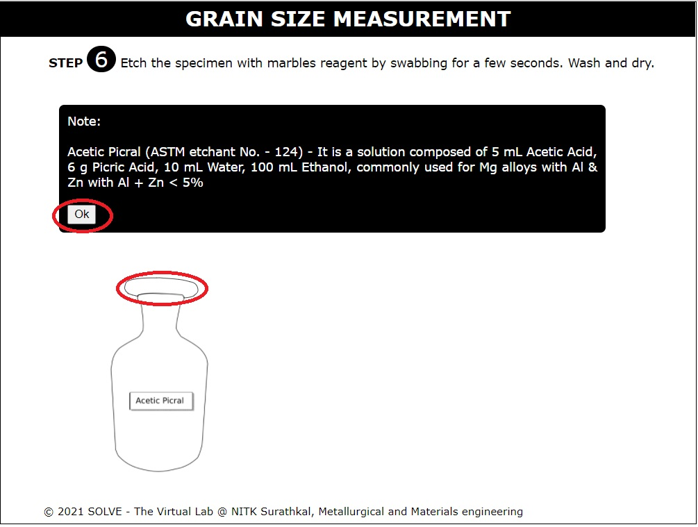 

6. Click on the bottle to pour the Alumina solution. 
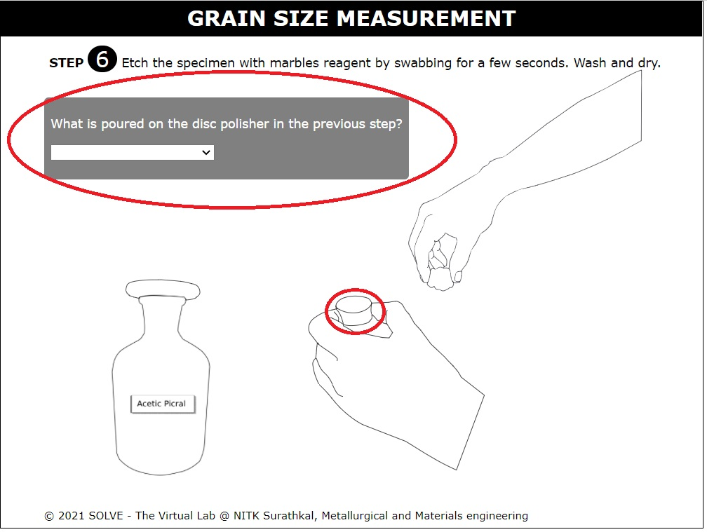 

7. Click on the hand first and then the switch-on button to start disc polishing. Click Ok after reading the note. Click on the Next button which appears after the step to proceed.  
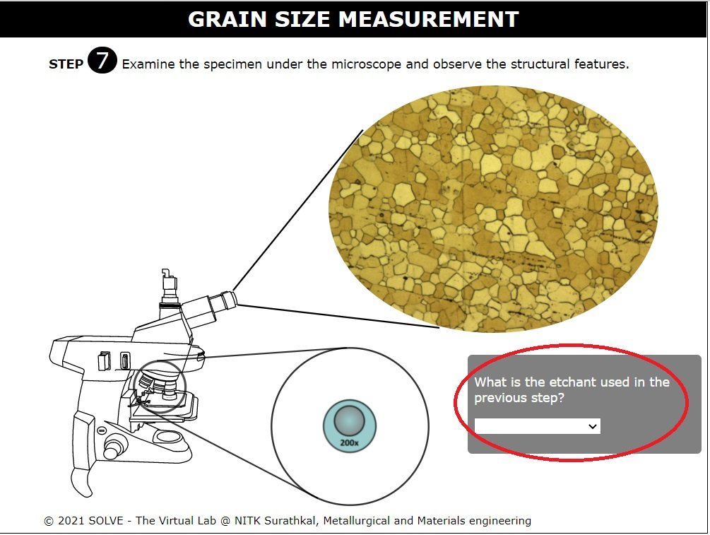 

8. Click Ok after reading the note. Click on the lid of the bottle. 
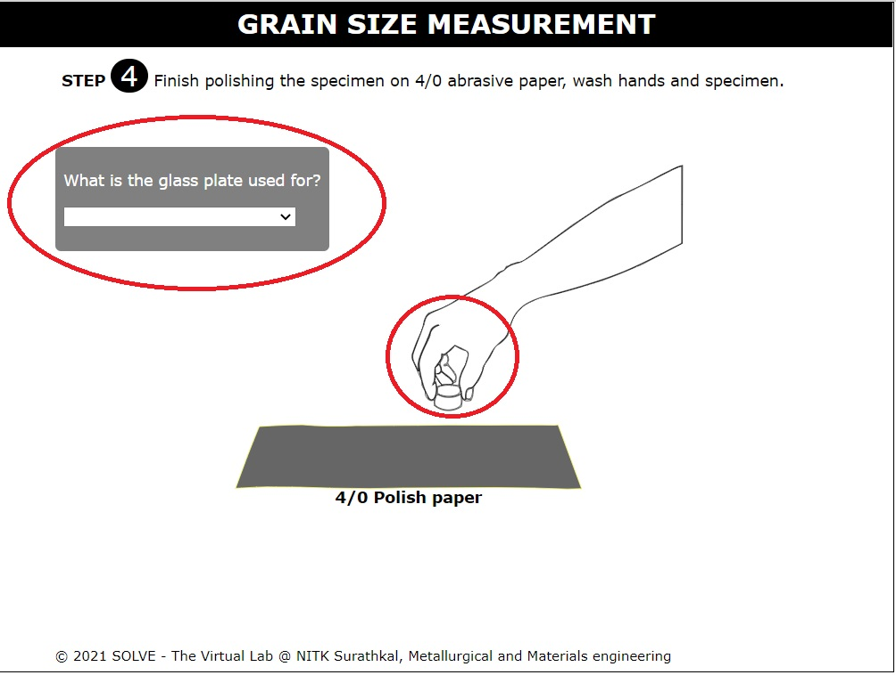 

9. Click on the hand to soak the cotton with the reagent. Follow this by clicking on the lid to close the lid. 
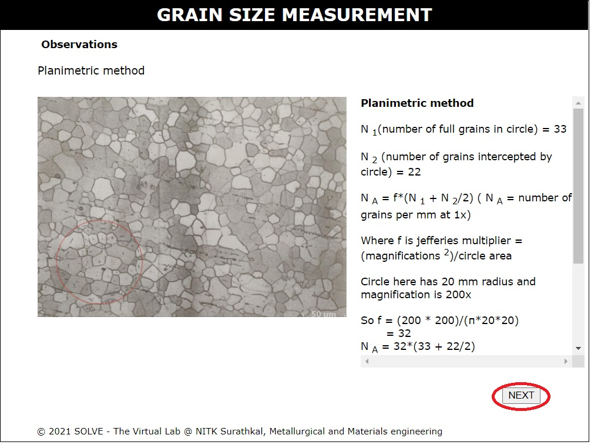 

10. Click on the sample to etch it. Follow this by answering the question. Click on the Next button which appears after the step to proceed. 
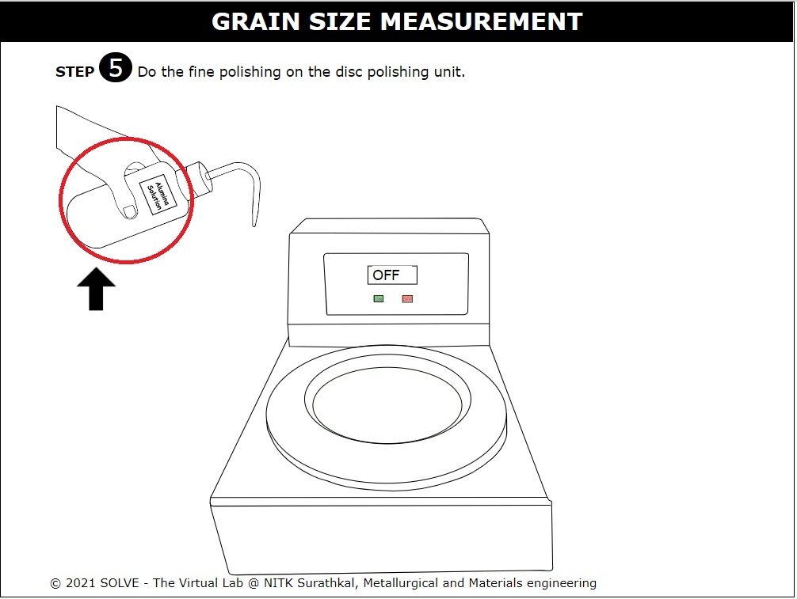 

11. Observe the microstructure and answer the question displayed. Click on the Next button which appears after the step to proceed. 
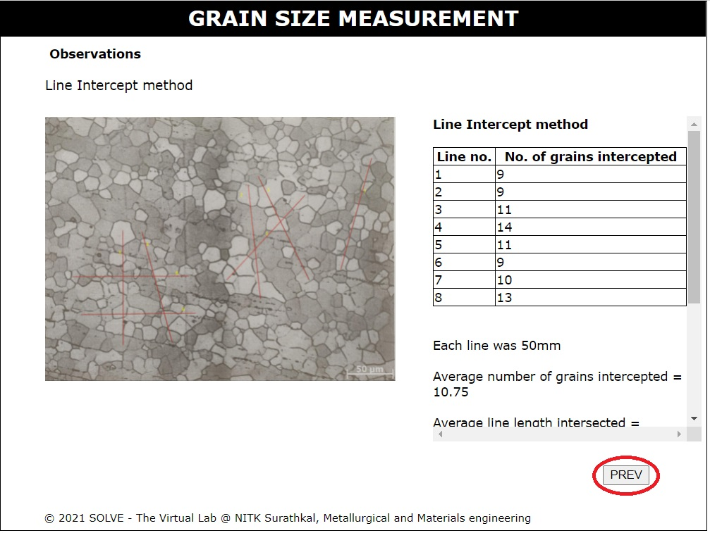 

12. Read and understand how to use the Planimetric method to calculate grain size. Scroll down to read further. Click on next to proceed to the Line Intercept Method.  
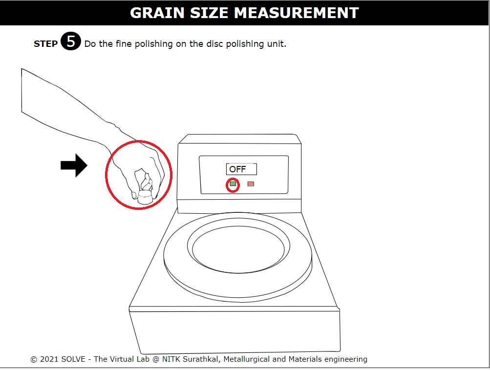 

13. Read and understand how to use the Line Intercept Method to calculate grain size. Scroll down to read further. Click on prev to return to the Planimetric Method.  
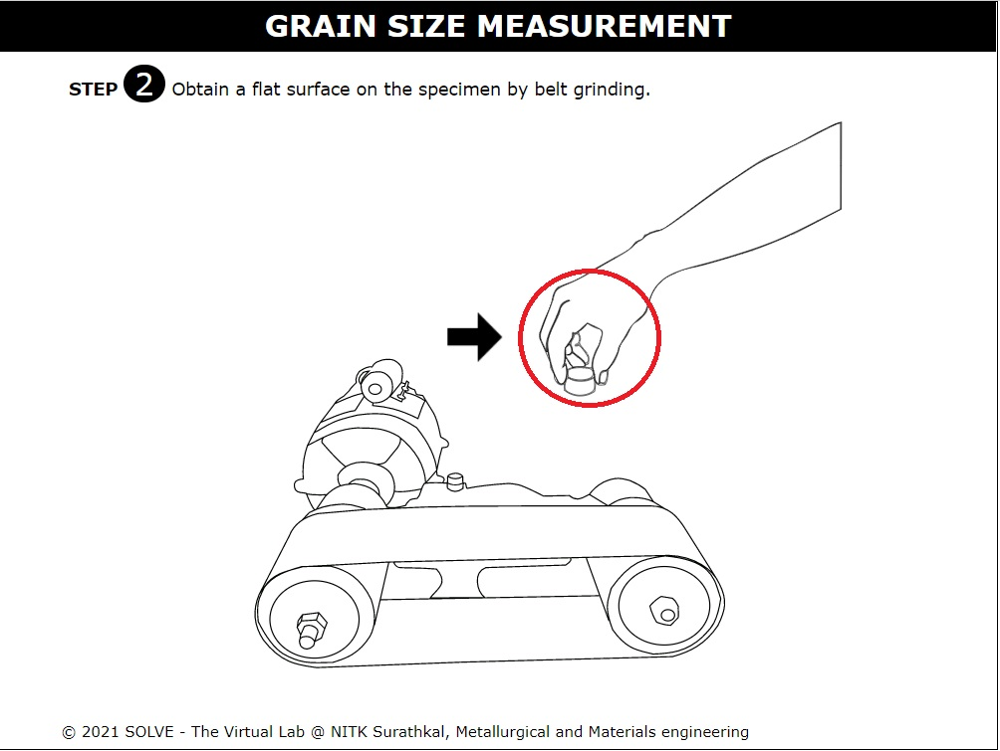 