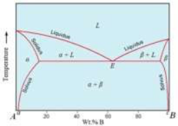
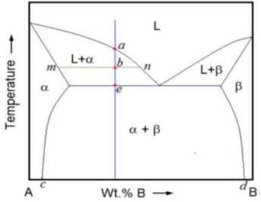

## <b> Pre-test</b>
#### Please attempt the following questions

 
 
Q 1.  What is the line that defines the solubility limit of A in B and B in A from the figure? 
a. Solidus line 
b. Liquidus line 
c. Solidus line and Liquidus line 
<b>d. Solvus line</b>  

Q 2.  Three phases (L+α+β) coexist at point E. This point is called ___________. 
a. Peritectic point 
b. Eutectic point 
<b>c. Eutectic point or composition</b>  
d. Eutectoid point 

Q 3.  In hypoeutectic alloys micro structure at room temperature consists of 
a. Proeutectic β and α 
<b>b. Proeutectic α and eutectic mixture (α+β)</b> 
c. Eutectic mixture (α+β) 
d. Proeutectic β and eutectic mixture (α+β) 

Q 4.  Why Pb-Sn eutectic alloys are used for soldering purpose? 
a. The melting point at eutectic point is maximum 
b. The melting point at the eutectic point is constant 
c. The boiling point at the eutectic point is maximum 
<b>d. The melting point at the eutectic point is minimum</b> 

 

Q 5.  Crystals of which material begin to form at point a from the figure? 
a. Crystals of proeutectic β 
<b>b. Crystals of proeutectic α</b>  
c. Crystals of eutectic (α+β) 
d. Crystals of proeutectic α and β 

Q 6.  At any point b, the α fraction is given by the lever rule as 
<b>a. bn/mn</b>  
b. mn/bn 
c. ab/be 
d. be/ab 

 

Q 7.  The inflection in the cooling curve between points a and e is due to 
a. Low temperature 
<b>b. Latent heat </b> 
c. High temperature 
d. Specific heat 

Q 8.  At the eutectic point (e) the eutectic reaction proceeds at a constant temperature as  
<b>a. F = 0</b>  
b. F = 1 
c. F = 2 
d. F = 3 

Q 9.  Any composition left of point c or right of a point will cool and solidify like a 
a. Eutectic 
<b>b. Isomorphous system</b>  
c. Proeutectic 
d. Eutectoid 

Q 10.  A 34.6% Pb-Sn alloy is cooled just below the eutectic temperature (183°C). What is the fraction of proeutectic α and eutectic mixture (α+β)? 
a. 70% and 30% 
b. 36% and 64% 
c. 30% and 70% 
<b>d. 64% and 36%</b>  

Q 11.  On heating, one solid phase results in another solid phase and a liquid phase during _____________ reaction. 
a. Eutectoid 
<b>b. Peritectic</b>  
c. Eutectic 
d. Peritectoid 

Q 12.  A first solid phase results in a second solid phase and another third solid phase on cooling during _______________ reaction. 
<b>a. Eutectoid</b>  
b. Peritectic 
c. Eutectic 
d. Peritectoid 
