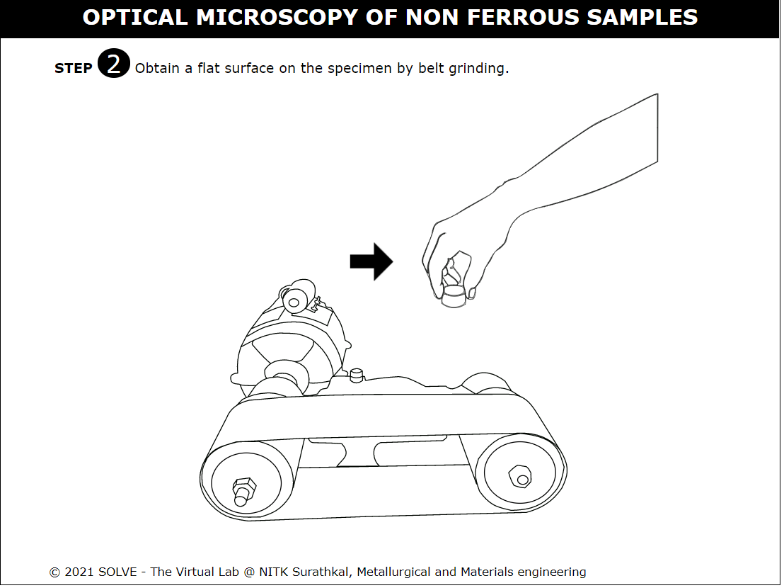
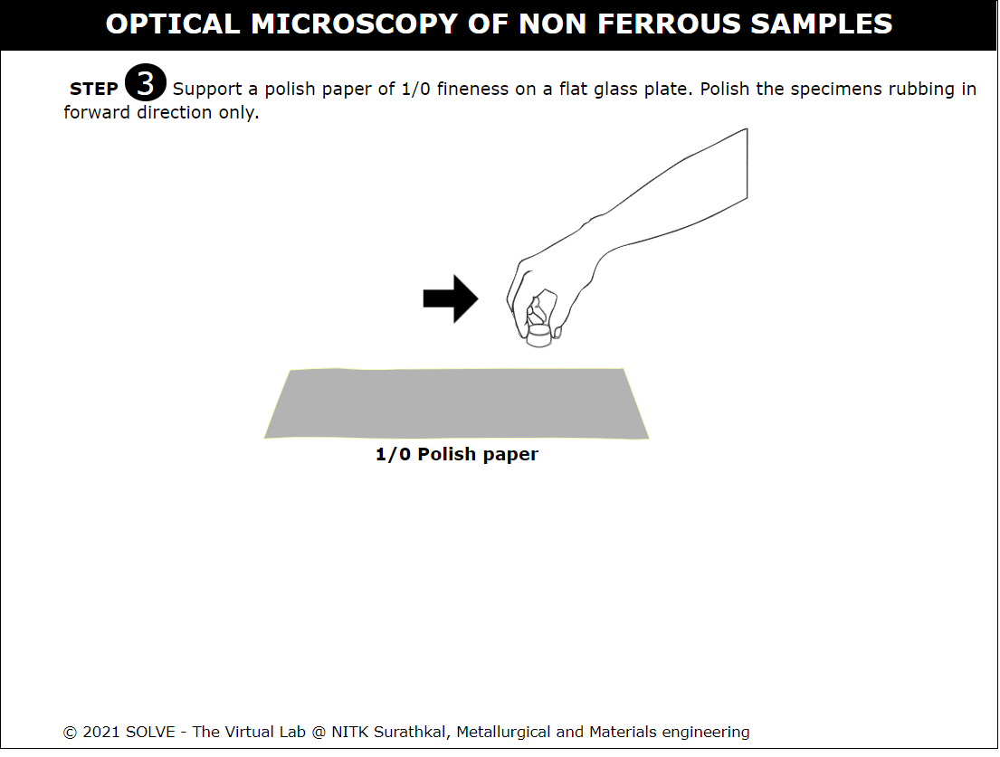
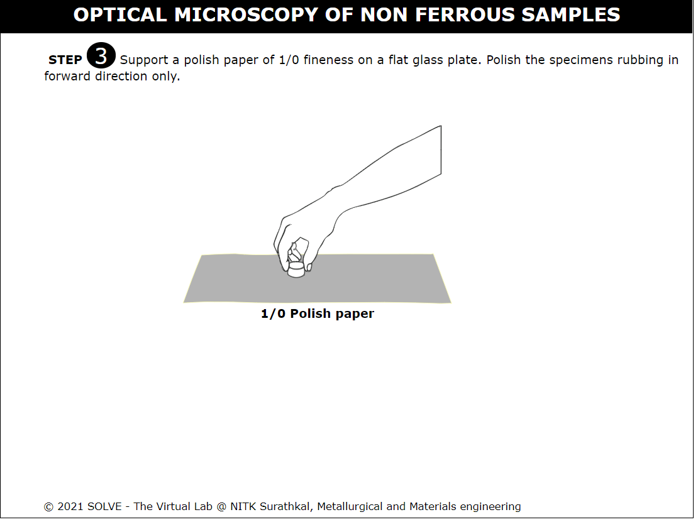
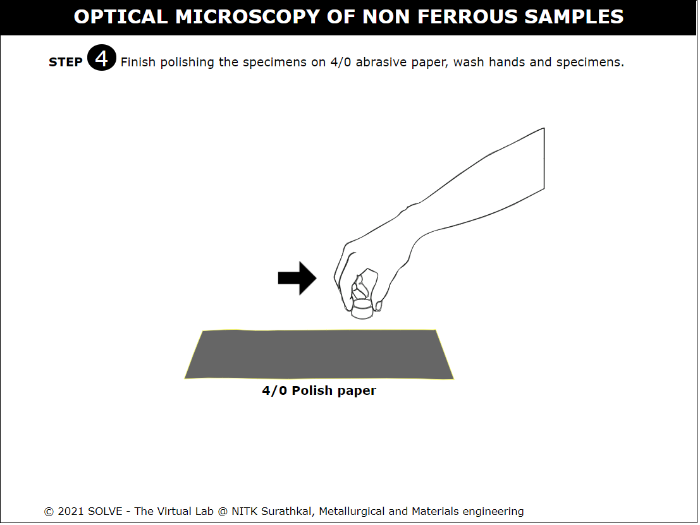
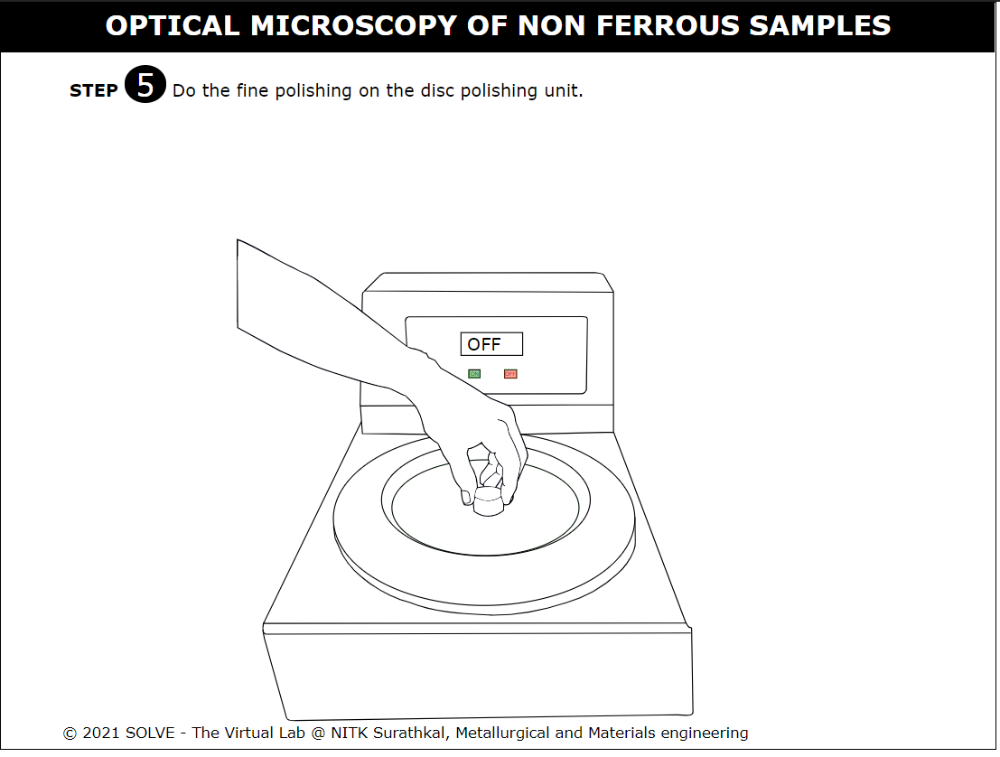
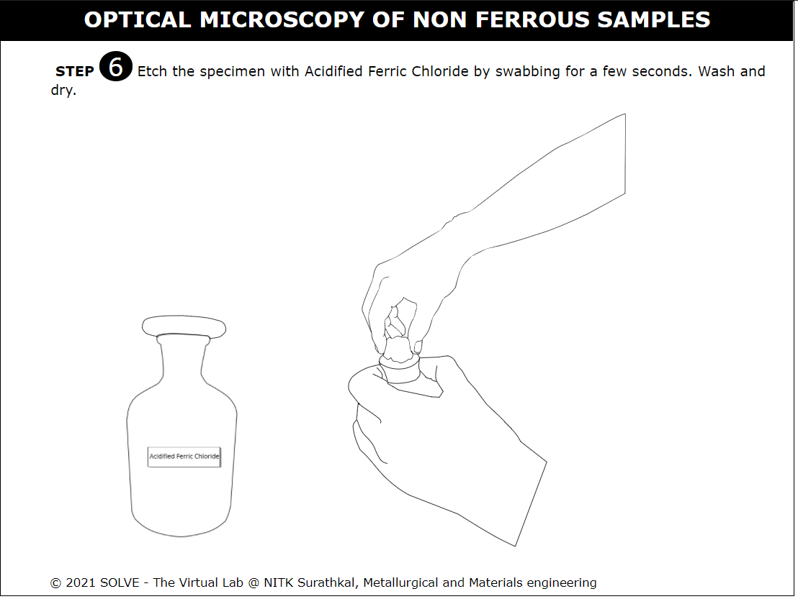
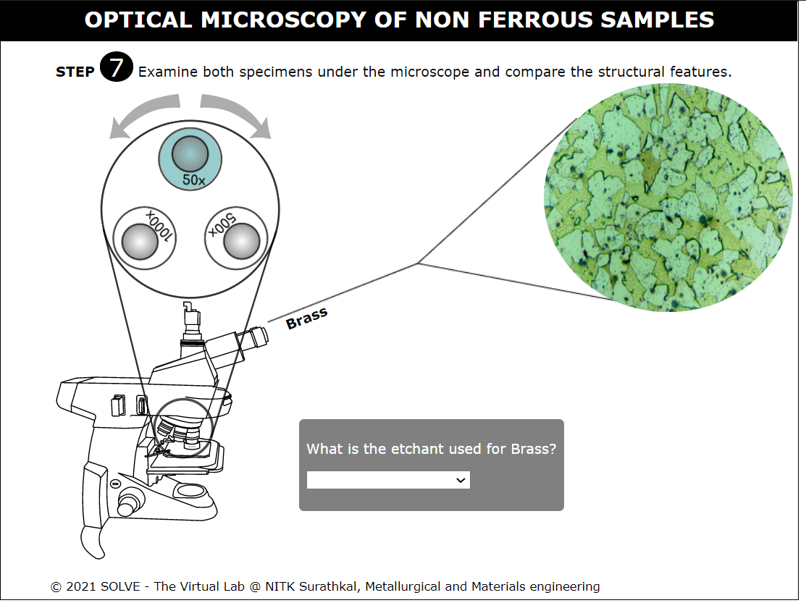

##### These procedure steps will be followed on the simulator

1. Obtain a flat surface on the specimen by belt grinding. 
 

2. Support firmly the polishing paper of fineness No.1 on a flat glass plate. 
 

3. Polish the specimen under very light pressure rubbing in forward direction only. 
 

4. Observe the scratches on the specimen. Scratches should not be very deep, but at the same time they should be uniformly in the same direction. When the above condition is satisfactory go to the next finer paper for polishing. 
 

5. After polishing on 4/0 abrasive paper, wash your hands and the specimen and do the fine polishing on the disc polishing unit.  
 

6. Clean off the polished surface of the specimen with water and dry it with an electric hot air blower.  
<!--   -->

7. Etch the specimen with Nital 2% reagent or Acidified Ferric Chloride based on the specimen by swabbing for one second to several seconds. Wash and dry.  
 

8. Examine both the specimen under the microscope and observe the structural features to observe differences between them. 
 
<!-- 
9. Click on the hand to soak the cotton with the reagent. Follow this by clicking on the lid to close the lid.  
  -->

<!-- 10. Click on the sample to etch it. Follow this by answering the question.  Click on the Next button which appears after the step to proceed.  
  -->

<!-- 11. Click the arrows to change the magnification and view the microstructures. Answer the question. Click on the Next button which appears after the step to proceed. 
  -->
<!-- 
12. Change the toggle bar to view the microstructure at different magnification (50x, 100x, 500x). Click on the microstructure and read the respective observation related to the microstructure. 
  -->
