##### These procedure steps will be followed on the simulator

1. Once the experiment is opened, click on the Description to understand the terminologies related to the experiment. Click on Next to proceed. 
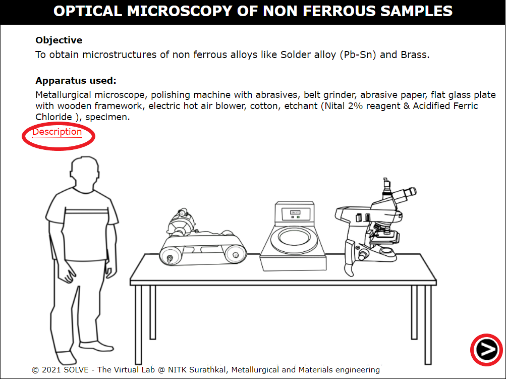 

2. Read about the samples taken into consideration. Select a sample and click on Next to proceed. 
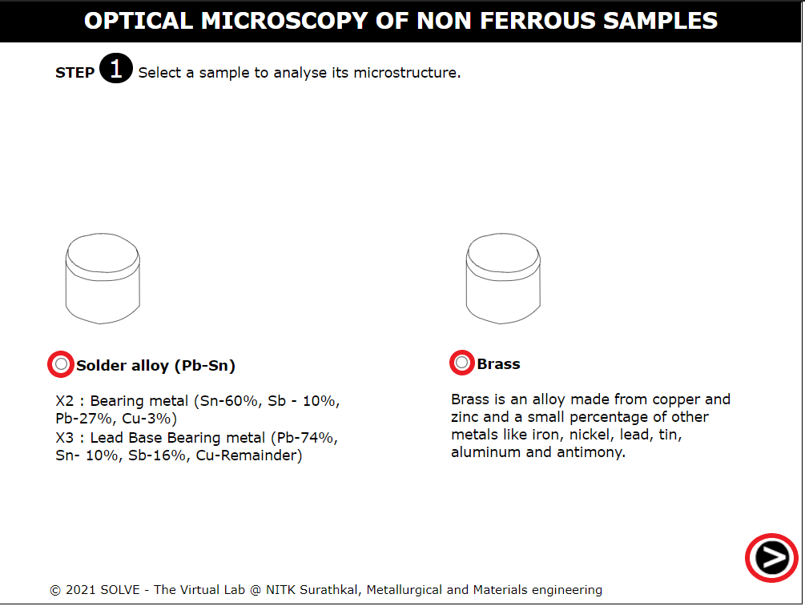 

3. Click on the hand to start the belt grinding process. Click on the Next button which appears after the step to proceed. 
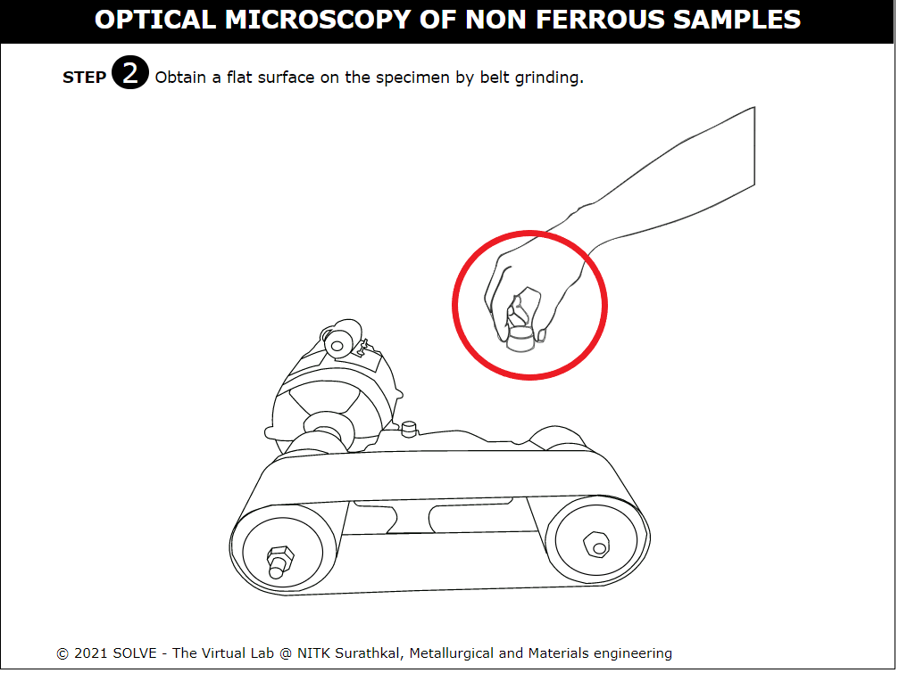 

4. Click on the hand to start polishing the sample and click Ok after reading the NOTE. Click on the Next button which appears after the step to proceed. 
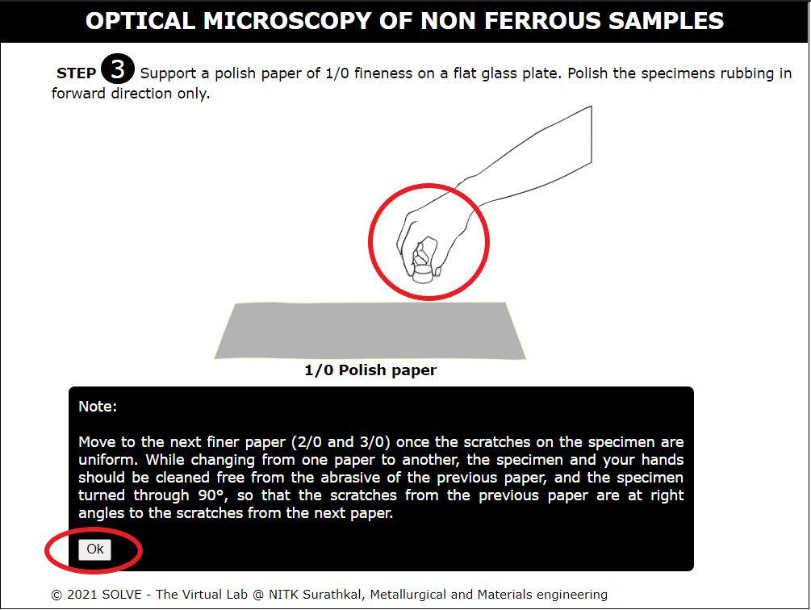 

5. Click on the hand first to continue the polishing of the sample. After this, answer the question. Click on the Next button which appears after the step to proceed. 
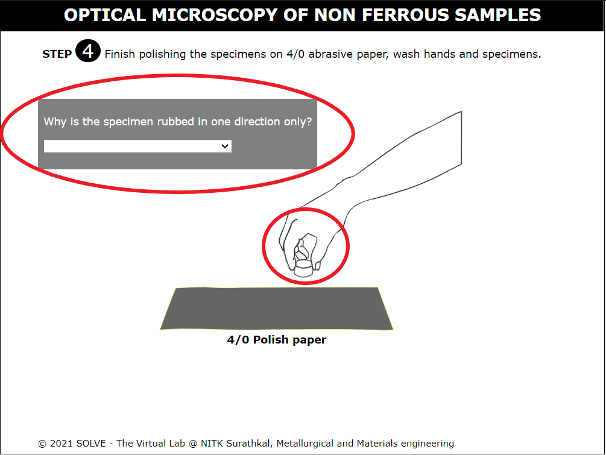 

6. Click on the bottle to pour the Alumina solution.  
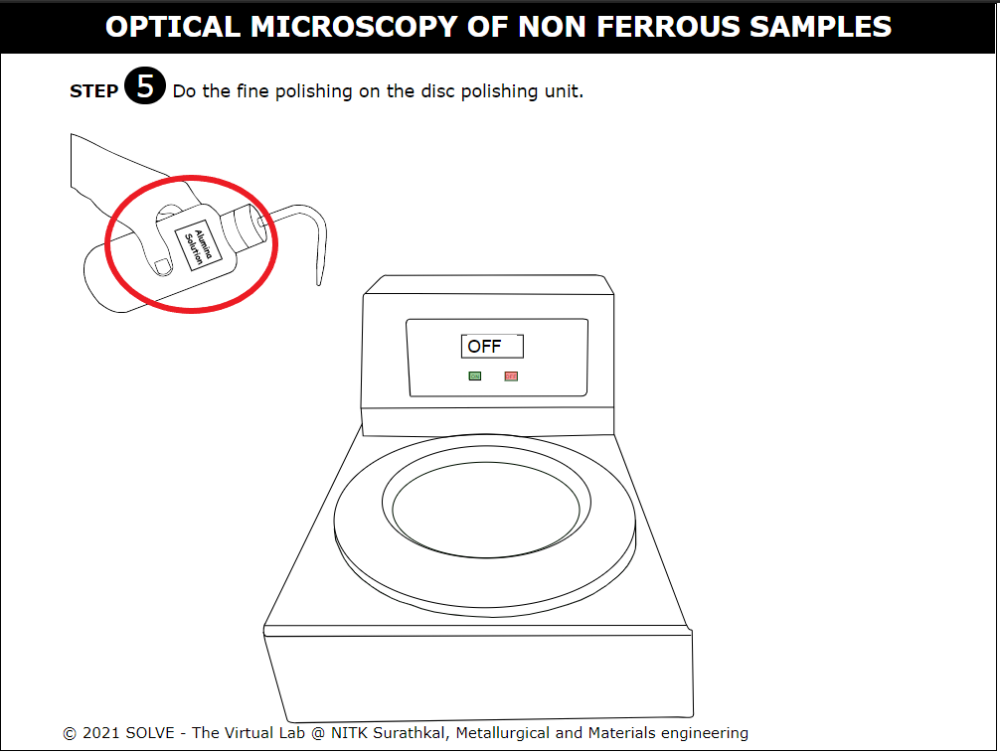 

7. Click on the hand first and then the switch-on button to start disc polishing. Switch-off to stop the disc polisher. Click Ok after reading the note.  Click on the Next button which appears after the step to proceed.  
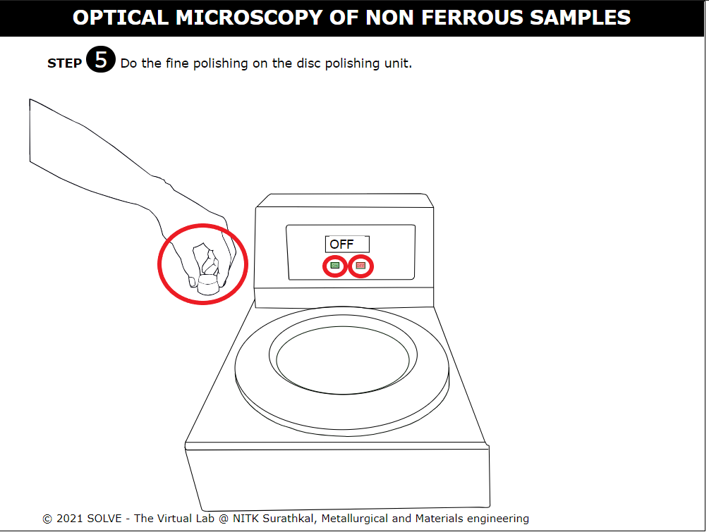 

8. Click Ok after reading the note. Click on the lid of the bottle.  
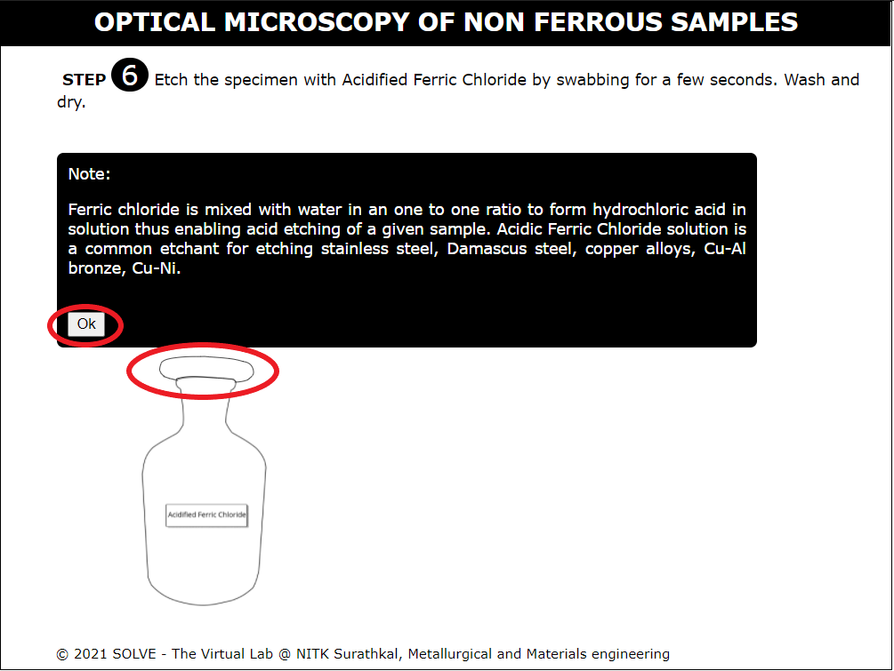 

9. Click on the hand to soak the cotton with the reagent. Follow this by clicking on the lid to close the lid.  
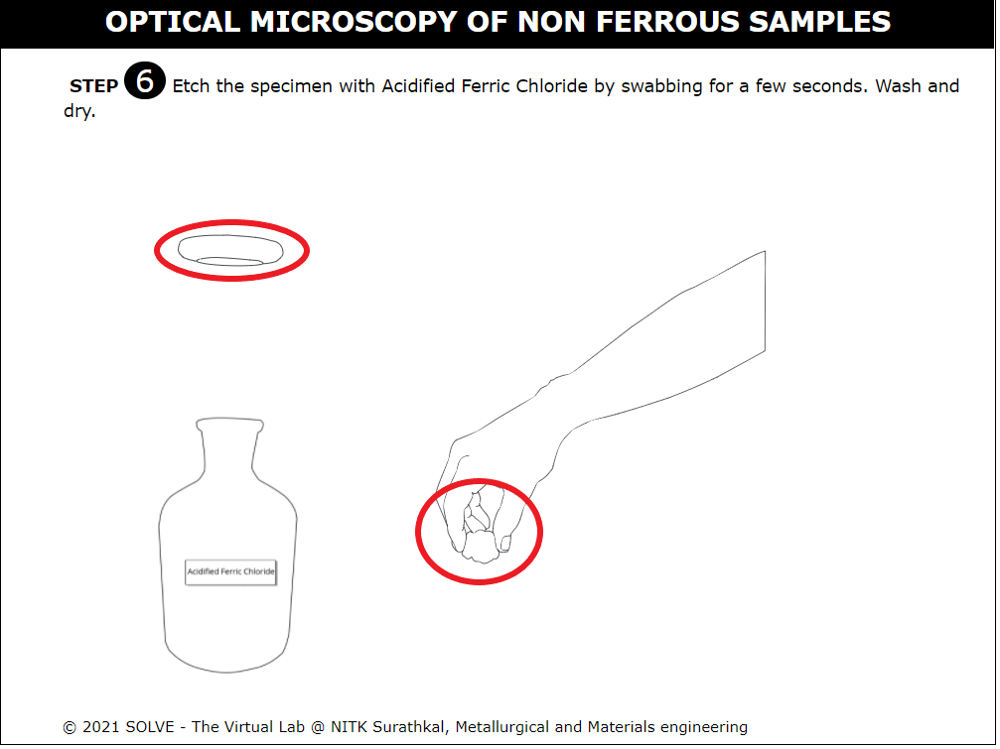 

10. Click on the sample to etch it. Follow this by answering the question.  Click on the Next button which appears after the step to proceed.  
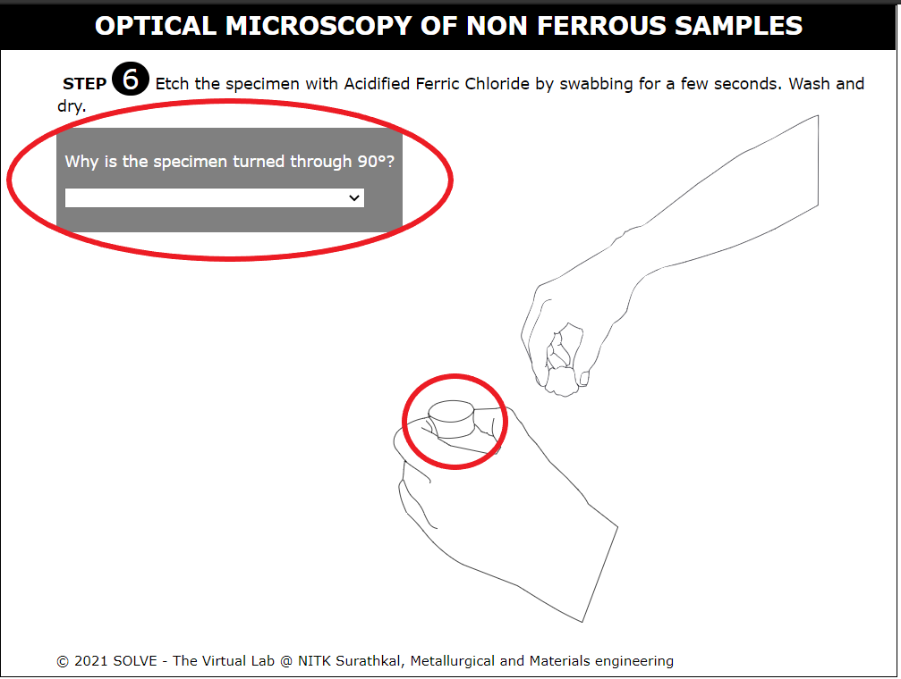 

11. Click the arrows to change the magnification and view the microstructures. Answer the question. Click on the Next button which appears after the step to proceed. 
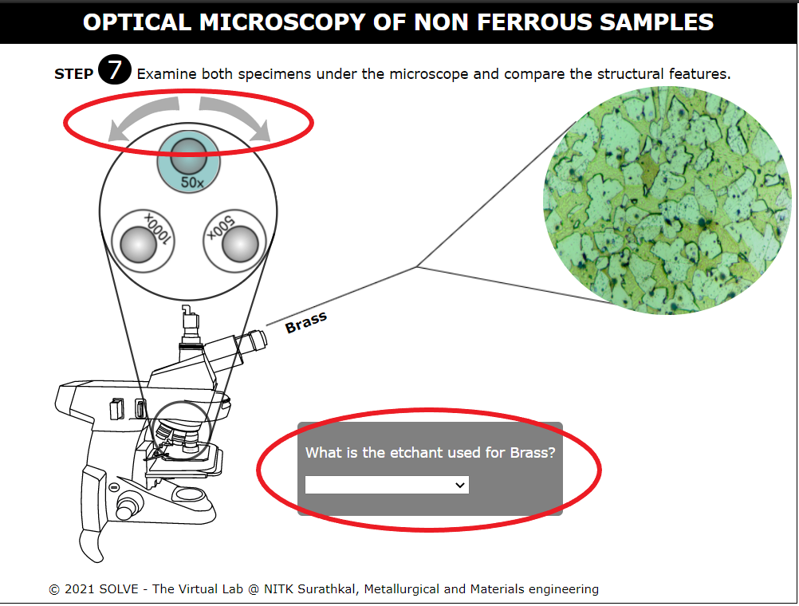 

12. Change the toggle bar to view the microstructure at different magnification (50x, 100x, 500x, 1000x). Click on the microstructure and read the respective observation related to the microstructure. 
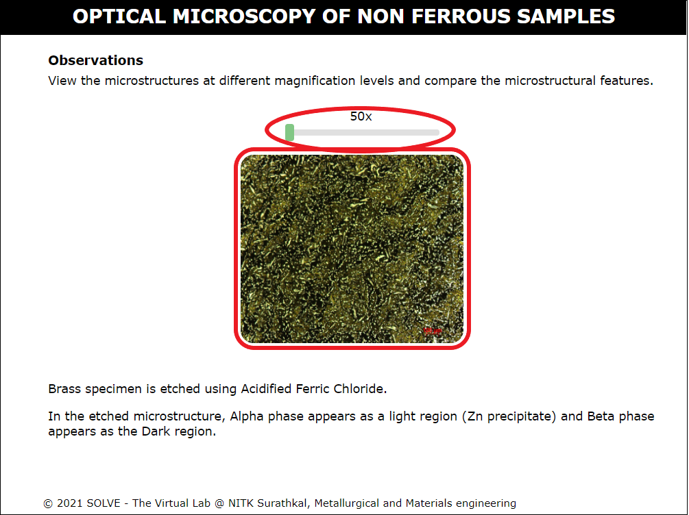 
