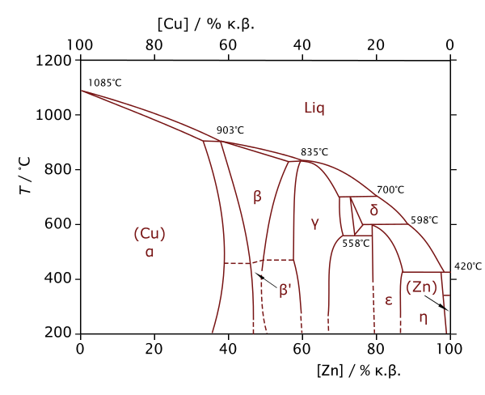
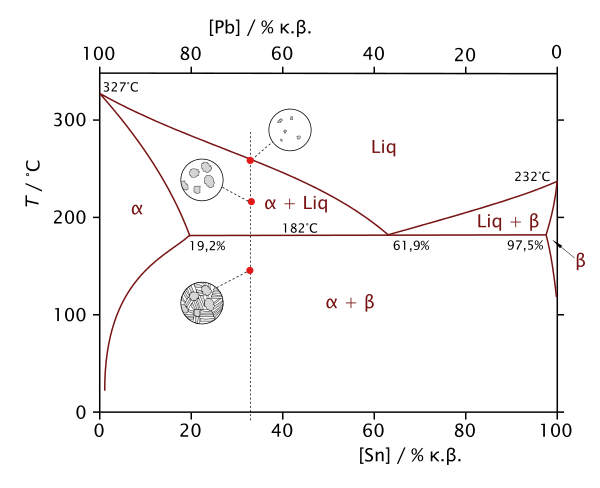

### INTRODUCTION 

The microstructure is the structure of a metal or alloy as observed, after etching and polishing, under a high degree of magnification using microscopes. The microstructure is one of the most important factors that affect the physical properties of the metal or alloy under consideration. So, by using the knowledge of a microstructure, we can analyze the behavior of a component made of a particular material. This is also important while predicting the failure of a component in certain given conditions.

Brass is an alloy made from copper and zinc and also includes a small percentage of other metals like iron, nickel, lead, tin, aluminum and antimony. The composition of pure brass is 85% copper and 15% zinc, where the high percentage of copper imparts ductility and zinc imparts the strength of brass. The % of zinc added to brass varies from 30 to 42% and is easily hot worked to improve strength, but the higher content of zinc also increases brittleness.

<!-- 
Mild steel has a fibrous structure while the structure of cast iron is granular and crystalline with a whitish or greyish tinge. Mild steel has lesser strength, more toughness and corrosion resistance than grey cast iron. 

Mild Steel is used in the form of :
<ul>
<li>Rolled sections
<li>Reinforcing bars
<li>Roof coverings
<li>Sheet piles
<li>Railway tracks
<li>Channels
<li>Angles
<li>Bolts
<li>Rivets
<li>Sheets
</ul> -->

 

Cu-Zn PHASE DIAGRAM
 

Source : (<a href=" https://commons.m.wikimedia.org/wiki/File:Cu-Zn-phase-diagram-greek.svg"> https://commons.m.wikimedia.org/wiki/File:Cu-Zn-phase-diagram-greek.svg</a>)

  

Lead based solder is the most common mixture used for soldering with composition of 60/40 (tin/lead) blend with a melting point around 180-190°C. Known colloquially as soft solder, tin is selected for its lower melting point while lead is used to inhibit the growth of tin whiskers. The higher the tin concentration, the better the tensile and shear strengths. A solder joint is the result of an intermetallic formation between the elements of the low temperature solder (typically some mixture of tin, lead, silver, bismuth, gold, indium or copper) and the substrate metallization being soldered.

 

 

Pb-Sn PHASE DIAGRAM 
 

Source : (<a href="https://commons.m.wikimedia.org/wiki/File:Pb-Sn-phase-diagram-greek.svg ">https://commons.m.wikimedia.org/wiki/File:Pb-Sn-phase-diagram-greek.svg </a>)

