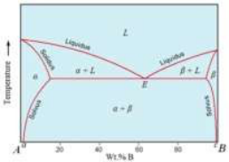
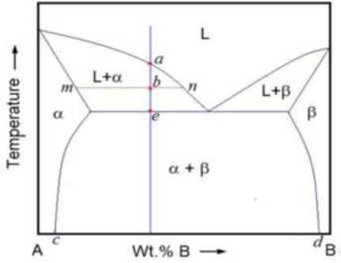
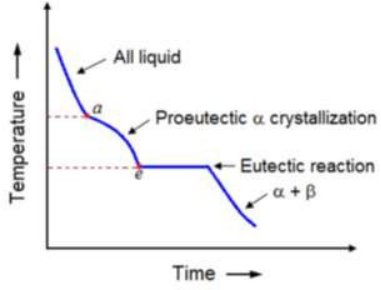

## <b> Pre-test</b>
#### Please attempt the following questions

 
<!--   -->
Q 1.  X-ray diffractometers are not used to identify which of these physical properties?  
a. Metals 
b. Polymeric materials 
c. Ceramics 
<b>d. Liquids</b>  

Q 2.  In a powder diffractometer, the sharpness of the lines is greatly determined by? 
a. Quality of the sample, size of the slit 
b. Thickness of the slit, amount of the sample 
<b>c. Quality of the slit, size of the sample</b>  
d. Composition of the sample 

Q 3.  The atomic numbers of the zirconium, molybdenum, palladium and tin are 40, 42, 46 and 50 respectively, then the suitable filter for x-radiation from molybdenum is 
a. Palladium 
<b>b. Zirconium</b> 
c. Tin 
d. Uranium 

Q 4.  The material used to construct the filter in X-ray diffraction is 
a. Metal with next higher atomic number 
b. Quartz 
c. Polymers 
<b>d. Metal with next lower atomic number</b> 

<!--   -->

Q 5.  The detector in X-ray diffraction that detects the visible radiation is 
a. Proportional counter 
<b>b. Scintillation counter </b>  
c. Silicon diode 
d. Quartz 

Q 6.  In gas phase detectors in XRD, high voltage is applied in the region of 
<b>a. Geiger counter region</b>  
b. Ionization region 
c. Proportional region 
d. Passivation region 

<!--   -->

Q 7.  Are the intensities of the diffraction peaks of a given compound in a mixture proportional to the fraction of the material in the mixture in diffractometers? 
a. No 
<b>b. Yes </b> 

Q 8.  Line intensities in diffractometers depend on ______ and kind of atomic reflection centres in each set of plates.  
<b>a. Number</b>  
b. Position 
c. Length 
d. Distance between lines 

Q 9.  When certain geometric requirements are satisfied, X-rays scattered from a crystalline solid can constructively interfere with each other and produce a diffracted beam. 
a. False 
<b>b. True</b>  

Q 10.  The X-ray diffraction is based upon 
a. Quantum equation 
b. Boltzmann equation 
c. Pascal equation 
<b>d. Bragg’s equation</b>  

