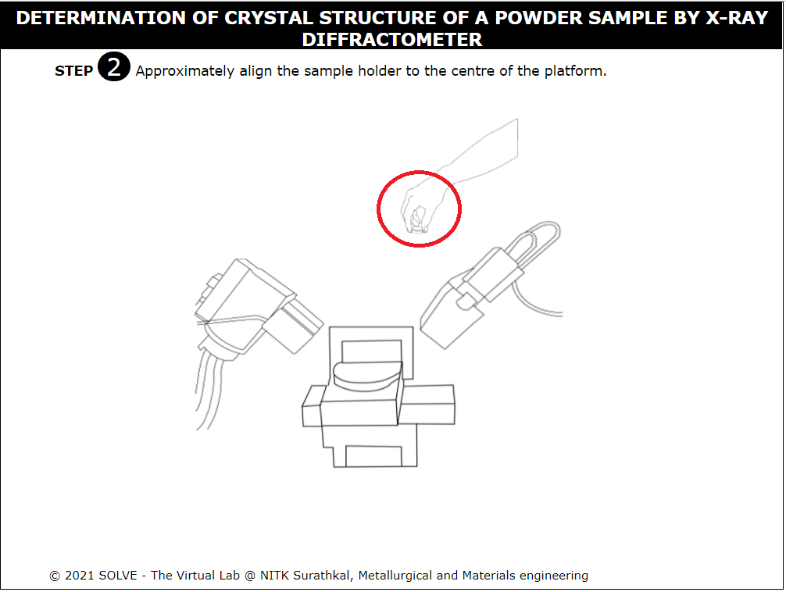

##### These procedure steps will be followed on the simulator

1. Once the experiment is opened, click on the Description to understand the terminologies related to the experiment. Click on Next to proceed.
 
 

2. Read the step procedure and the information about the sample provided. Click next to proceed.
 
 

3. Click on the hand to place the sample on the stage, click next to proceed. 
 

4. Click start and then proceed to read all the parameters set that were used to perform the XRD experiment. Click on proceed to continue. 
 

5. Click on start and then click on output to proceed.
 
 

6. Observe the output graph displayed by the computer and click on next to proceed. 
 

7. Analyze the XRD plot and click on next to proceed.
  
 

8. Read the table given and click on the arrow to move to the next part of the observation. Click on Prev to go back to the XRD plot.
  
 

9. Go through the observed values obtained from the computer post XRD analysis and read the result. 
  
 
