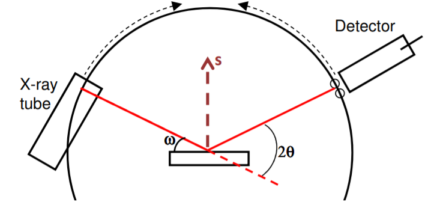
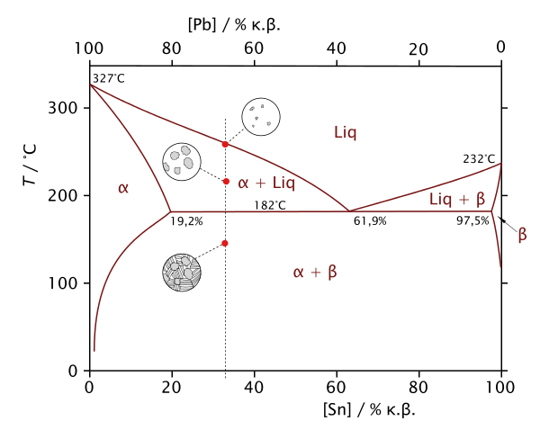

### INTRODUCTION 

For X-Ray wavelengths similar to the d-spacing of a crystal lattice, Max Von Laue (1912) discovered that crystalline substances act as 3D diffraction gratings. This procedure is termed as XRD and has become a commonly used technique for the studying of atomic spacing and crystal structure.

Constructive interference of monochromatic X-rays on a crystalline sample forms the basis of X-Ray diffraction. These X-rays are generated by a cathode ray tube which is further filtered to produce monochromatic radiation. It is then collimated to achieve good concentration and directed towards the sample. When conditions satisfy Bragg's Law, the interaction of the incident rays with the sample produces constructive interference and a diffracted ray.

### Bragg’s Law : nλ=2d sin θ

Bragg’s law relates the wavelength of electromagnetic radiation (λ) to the diffraction angle (θ) and the lattice spacing (d) in a crystalline sample. These diffracted X-rays are then detected, processed and counted using a detector in the XRD set-up. 

Due to the random orientation of the powdered sample material, all possible diffraction directions of the lattice can be attained by scanning the sample through a range of 2θ angles. Conversion of the diffraction peaks to d-spacings allows identification of the mineral because each mineral has a set of unique d-spacings and hence, they have unique XRD Peaks associated with them. Typically, this is achieved by comparison of d-spacings (XRD peaks) with standard reference patterns.

 

Schematic diagram of a XRay powder diffractometer
 

<a href="http://prism.mit.edu/xray/Basics%20of%20X-Ray%20Powder%20Diffraction.pdf" target="_blank">Source </a>

  

<!-- ### NOTE

The incident angle, ω, is defined between the X-ray source and the sample. 
The diffraction angle, 2 θ, is defined between the incident beam and the detector. 
The incident angle ω is always ½ of the detector angle 2 θ . 

 

 

Pb-Sn PHASE DIAGRAM 
 

Source : (<a href="https://commons.m.wikimedia.org/wiki/File:Pb-Sn-phase-diagram-greek.svg ">https://commons.m.wikimedia.org/wiki/File:Pb-Sn-phase-diagram-greek.svg </a>)
 -->
