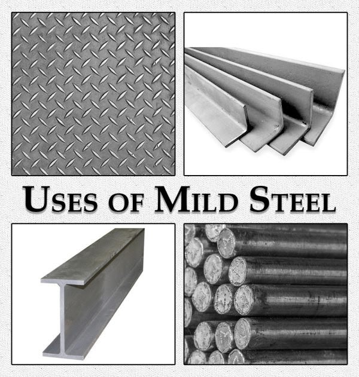
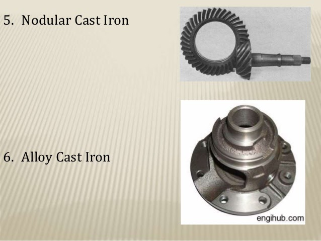

### INTRODUCTION 

The microstructure is the structure of a metal or alloy as observed, after etching and polishing, under a high degree of magnification using microscopes. The microstructure is one of the most important factors that affect the physical properties of the metal or alloy under consideration. So, by using the knowledge of a microstructure, we can analyze the behavior of a component made of a particular material. This is also important while predicting the failure of a component in certain given conditions.

Mild steel is a type of steel containing 0.15-0.25% carbon content and very few additional alloying elements. It is also called low carbon steel or study steel. Cast iron is a brittle alloy of iron and carbon that can be readily cast in a mould. Cast iron contains about 2-4% of carbon. It also contains various impurities like Phosphorus, silicon, manganese and sulphur.

Mild steel has a fibrous structure while the structure of cast iron is granular and crystalline with a whitish or greyish tinge. Mild steel has lesser strength, more toughness and corrosion resistance than grey cast iron. 

Mild Steel is used in the form of :
<ul>
<li>Rolled sections
<li>Reinforcing bars
<li>Roof coverings
<li>Sheet piles
<li>Railway tracks
<li>Channels
<li>Angles
<li>Bolts
<li>Rivets
<li>Sheets
</ul>

 

Mild Steel Applications
 

Source : (<a href="https://gharpedia.com/blog/what-is-the-difference-between-mild-steel-and-stainless-steel/">https://gharpedia.com/blog/what-is-the-difference-between-mild-steel-and-stainless-steel/</a>)

  
Cast Iron is used in the form of :
<ul>
<li>Ball mills
<li>Cement mixers
<li>Nozzles
<li>Pipe fittings
<li>Railroad equipment
<li>Industrial casters
<li>Chain-hoist assemblies
<li>Camshaft
<li>Crankshaft
<li>Furnace doors
<li>Elevator doors
</ul>

 

 

 

Cast Iron Applications
 

Source : (<a href="https://www.slideshare.net/mobile/usamatahir66/cast-iron-amp-its-structure">https://www.slideshare.net/mobile/usamatahir66/cast-iron-amp-its-structure</a>)

